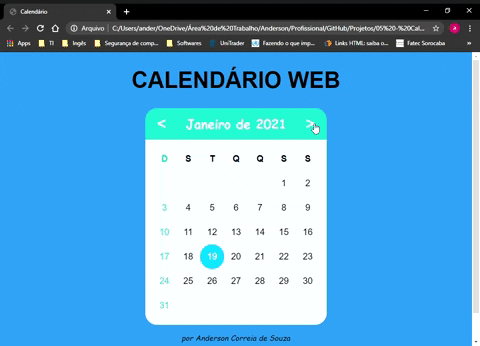

<h1>Calendário Web</h1>

Esse foi um upgrade do projeto <a href="https://github.com/Anderson815/Calendario-Terminal">Calendário Terminal</a>, porém agora para a versão Web.

<h2>:dart: Objetivo</h2>

Reproduzir um calendário gráfico na Web.

Funcionalidades do sistema:

<ul>
  <li>Avançar um mês.</li>
  <li>Voltar um mês.</li>
  <li>Pesquisar um mês.</li>
</ul>

<h2>:mortar_board: Habilidades usadas</h2>
<ul>
  <li>HTML</li>
  <li>CSS</li>
  <li>JS</li>
  <li>DOM</li>
</ul>

<h2>:package: Requisitos</h2>

Possuir algum navegador (de preferência o Google Chrome).

<h2>:checkered_flag: Para abrir a página</h2>
  <ol>
    <li>Fazer o clone desse repositório na sua máquina, para isso, no terminal do git, execute este comando: git clone https://github.com/Anderson815/Calendario_-_Web.git calendario.</li>
    <li>abra a pasta calendario e abra o arquivo index.html (de preferência utilize o Google Chrome).</li>
  </ol>

<h2>:pray: Ajuda</h2>

  

  Se você gostou do projeto, por favor não esqueça de:
  

  
  <ol>
    <li>Dar sua recomendação, das habilidade utilizadas nesse projeto, no <a href="linkedin.com/in/anderson-correia">meu LinkedIn</a>.</li>
    <li>Caso você tenha algum comentário, feedback ou sugestão me mande uma mensagem também no <a href="linkedin.com/in/anderson-correia">meu LinkedIn</a>.</li>
  </ol>
  
  

  Muito obrigado pela sua colaboração !!!
  

